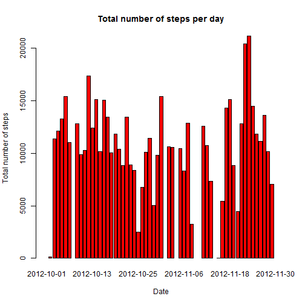
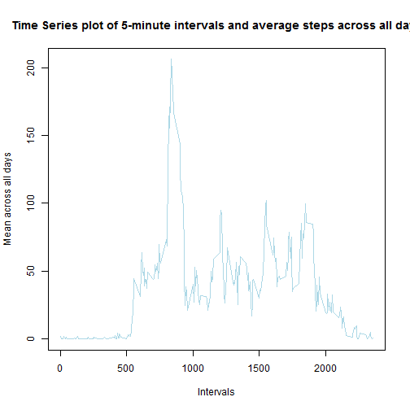
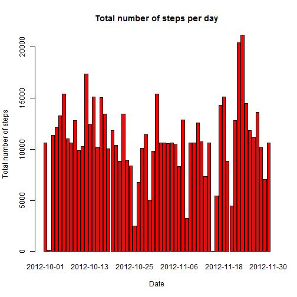
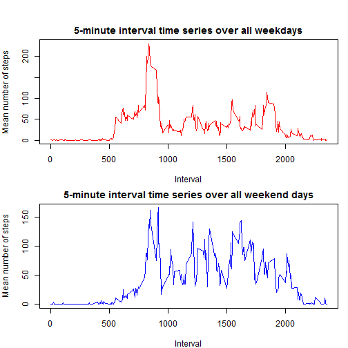

# Reproducible Research: Peer Assessment 1


## Loading and preprocessing the data

Load data and transform Date column into Date format.


```r
data <- read.csv2("activity.csv", sep = ",", header = T, na.strings="NA")
data$date <- as.Date(data$date)
```

## What is mean total number of steps taken per day?

### Histogram of total number of steps taken each day


```r
plotdata <- tapply(data$steps, data$date, FUN = sum, na.omit=TRUE)
barplot(plotdata, main= "Total number of steps per day",
        xlab = "Date", ylab = "Total number of steps", col ="red")
```

 

Calculating mean and median total number of steps per day


```r
median <- median(plotdata, na.rm = TRUE)
median
```

```
## [1] 10766
```

```r
mean <- mean(plotdata, na.rm = TRUE)
mean
```

```
## [1] 10767
```

## What is the average daily activity pattern?

1. Time Series plot of the 5-minute interval and the average number of steps taken, averaged across all days


```r
interval_means <- tapply(data$steps, data$interval, FUN = mean, na.rm = T)
plot(unique(data$interval), interval_means,
     type = "l", xlab = "Intervals",
     ylab = "Mean across all days",
     main = "Time Series plot of 5-minute intervals and average steps across all days",
     col = "lightblue")
```

 

2. Which 5-minute interval, on average across all the days in the dataset, contains the maximum number of steps?


```r
mean_intervals  <- data.frame(unique(data$interval), interval_means)
names(mean_intervals) <- c("interval", "mean")
highest_interval <- mean_intervals[mean_intervals$mean == max(mean_intervals$mean),][1]
highest_interval
```

```
##     interval
## 835      835
```

## Inputing missing values

1. Calculate and report the totan number of rows with NA's


```r
missing_rows <- sum(!complete.cases(data))
missing_rows
```

```
## [1] 2304
```

2. For each interval with a NA value, replace the NA with the mean across all days for that particular interval


```r
for ( i in 1:length(data$steps)) {
        if (is.na(data$steps[i])) {
                data$steps[i] <- as.integer(mean_intervals[ mean_intervals$interval == data$interval[i],][2])               
        }
}
```

3. Plotting Histogram again


```r
plotdata <- tapply(data$steps, data$date, FUN = sum, na.omit=TRUE)
barplot(plotdata, main= "Total number of steps per day",
        xlab = "Date", ylab = "Total number of steps", col ="red")
```

 

The values of mean and median differ compared to the initial values obtained prior to filling NA values. Inputting the mean value for each interval that had a NA value before makes the total daily number of steps to go up.


```r
median <- median(plotdata, na.rm = TRUE)
median
```

```
## [1] 10642
```

```r
mean <- mean(plotdata, na.rm = TRUE)
mean
```

```
## [1] 10751
```

## Are there differences in activity patterns between weekdays and weekends?

First, add another column to the data dataframe with the day. Then create a function to classify the day as "weekday" or "weekend"


```r
data$day <- weekdays(data$date)

weekday <- function(day){
    if ( day %in% c("Monday","Tuesday", "Wednesday", "Thursday", "Friday") ) {
        kind <- "weekday"
    }
    else {
        kind <- "weekend"
    }
    return (kind)
}
data$day <- sapply(data$day, FUN = weekday)
data$day <- as.factor(data$day)
```

Then, create a time series plot of the 5-minute interval (x-axis) and the average number of steps taken, averaged across weekday days or weekend days (y-axis). Observe the graphs show that on the weekends there are more steps at the times between 10am and 5pm when people work during the weekdays whereas they are more likely to be outside or walking on the weekends.


```r
weekday_set <- data[data$day == "weekday",]
weekend_set <- data[data$day == "weekend",]
weekday_means <- tapply(weekday_set$steps, weekday_set$interval, FUN = mean, na.rm = T)
weekend_means <- tapply(weekend_set$steps, weekend_set$interval, FUN = mean, na.rm = T)
par(mfrow = c(2,1), mar = c(4,4,2,1), oma = c(0,0,2,0))
plot(unique(data$interval), weekday_means, type ="l",
     main = "5-minute interval time series over all weekdays",
     xlab = "Interval", col = "red",
     ylab = "Mean number of steps")
plot(unique(data$interval), weekend_means, type = "l",
     main = "5-minute interval time series over all weekend days",
     xlab = "Interval", col = "blue",
     ylab = "Mean number of steps")
```

 
